# 0、前置条件

## 0.1、putMapping

因为传入的对象不是固定的，所以传入Map<String, Property>

```java
//string 字段名
//property 字段类型
Map<String, Property> map=new HashMap<>(20);
        client.indices().putMapping(PutMappingRequest.of(mapping->mapping
        .properties(map)
        .index(myTableName)
        ));
```

在我们的项目中类型比较动态，所以维护了一个枚举，其他类型与ES类型的映射关系，如：

```java
    Date(ColumnType.Date,
        Property.of(p->p.date(d->d))
        ) 
```

## 0.2、index

保存数据将处理好的数据转成json

```java
        Map<String, Object> data=...;
        ObjectMapper objectMapper=new ObjectMapper();
        String jsonStr=objectMapper.writeValueAsString(data);
        IndexResponse index=client.index(i->i
            .index(myTableName)
            .withJson(new StringReader(jsonStr))
            );
```

以Date类型举例，data中的key是字段名，value是处理后（格式化后）的时间。 下面示例中的`data.put("field","")`value均是处理后的数据

# 1、类型

## 1.1、 Date [官网地址](https://www.elastic.co/guide/en/elasticsearch/reference/8.1/date.html)

> **putMapping**
>> **Java Client**
>>> 默认  
> > `Property.of(p -> p.date(d -> d))`
>>
>>> 配置格式化类型，  
> >  如想了解在枚举中如何动态配置properties中的配置，请移步[TODO]()
>>> ```java
>>> Property.of(p -> p.date(d -> d.format("yyyy-MM-dd HH:mm:ss.SSS||strict_date_optional_time||epoch_millis||yyyy-MM")
>>> ```
>> **Rest Api**
>> ```java
>> PUT /date_create_index/_mapping
>> {"properties":{"date_field":{"type":"date","format":"yyyy-MM-dd HH:mm:ss.SSS||strict_date_optional_time||epoch_millis||yyyy-MM"}}}
>> ```  
>> **结果**  
> > 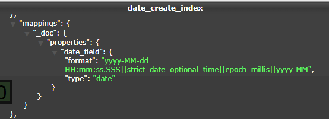

> **index**
>> **Java Client**  
> > `data.put("date_field","格式化后的date[2022-06-29 11:13:48.606]")`
>
>> **Rest Api**
>> ```java
>> POST /date_create_index/_doc
>> {"date_field":"2022-06-29 11:13:48.606"}
>> ```
>> **结果**  
> 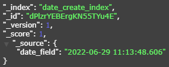

## 1.2、point [官方文档](https://www.elastic.co/guide/en/elasticsearch/reference/8.1/point.html)

> **putMapping**
>> **Java Client**  
> > `Property.of(p -> p.point(po -> po.ignoreZValue(false)))`  
> > 如果为true(默认)，将接受三个维度点(存储在源中)，但只有纬度和经度值将被索引  
> > 如果为false，传入高度将报错`Exception parsing coordinates: found Z value [123.0] but [ignore_z_value] parameter is [false]`
>
>> **Rest Api**
>> ```java
>> PUT /point_create_index/_mapping
>> {"properties":{"point_field":{"type":"point","ignore_z_value":false}}}
>> ```
>> **结果**  
> > 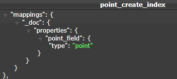

> **index**
>> **Java Client**  
> > `data.put("point_field",[41.12, -71.34])`
>
>> **Rest Api**
>> ```java
>> POST /point_create_index/_doc
>> {"point_field":[41.12,-71.34]}
>> ```
>> **结果**  
> > 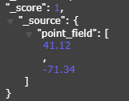

## 1.3、geo_point [官方文档](https://www.elastic.co/guide/en/elasticsearch/reference/8.1/geo-point.html)

> **putMapping**
>> **Java Client**  
> > 如果为true(默认)，将接受三个维度点(存储在源中)，但只有纬度和经度值将被索引  
> > `Property.of(p -> p.geoPoint(g -> g))`
>
>> **Rest Api**
>> ```java
>> PUT /geo_point_create_index/_mapping
>> {"properties":{"geo_point_field":{"type":"geo_point"}}}
>> ```
>> **结果**  
> > 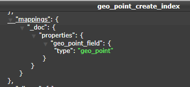

> **index**
>> **Java Client**  
> > `data.put("geo_point_field",[41.12,-71.34,8848.0])`
>
>> **Rest Api**
>> ```java
>> POST /geo_point_create_index/_doc
>> {"geo_point_field":[41.12,-71.34,8848.0]}
>> ```
>> **结果**  
> > 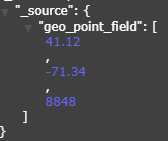

## 1.4、shape [官方文档](https://www.elastic.co/guide/en/elasticsearch/reference/8.1/shape.html)

### 1.4.1、point

> **putMapping**
>> **Java Client**  
> > 如果为true(默认)，将接受三个维度点(存储在源中)，但只有纬度和经度值将被索引  
> > `Property.of(p -> p.shape(g -> g.ignoreZValue(false).ignoreMalformed(true)))`
>
>> **Rest Api**
>> ```java
>> PUT /shape_point_create_index/_mapping
>> {"properties":{"shape_point_field":{"type":"shape","ignore_malformed":true,"ignore_z_value":false}}}
>> ```
>> **结果**  
> > 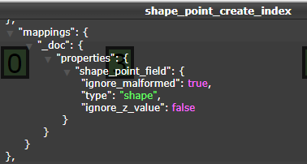

> **index**
>> **Java Client**
>> ```java
>> Map<String,Object> map=new HashMap<>(2);
>> map.put("type","point");
>> map.put("coordinates",Arrays.asList(point.getLon(), point.getLat()));
>> ```
>
>> **Rest Api**
>> ```java
>> POST /shape_point_create_index/_doc
>> {"shape_point_field":{"lon":41.12,"lat":-71.34}}  
>> ```
>> **结果**  
> > 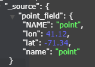

### 1.4.2、lineString

由两个或多个位置的数组定义的linestring。通过只指定两个点，linestring将表示一条直线。指定两个以上的点将创建任意路径。下面是一个LineString的示例在GeoJSON。
> **putMapping**
>> **Java Client**  
> > 如果为true(默认)，将接受三个维度点(存储在源中)，但只有纬度和经度值将被索引  
> > `Property.of(p -> p.shape(g -> g.ignoreZValue(false).ignoreMalformed(true)))`
>
>> **Rest Api**
>> ```java
>> PUT /shape_line_create_index/_mapping
>> {"properties":{"shape_line_field":{"type":"shape","ignore_malformed":true,"ignore_z_value":false}}}
>> ```
>> **结果**  
> > 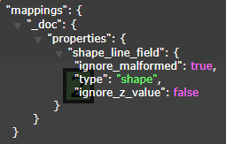

> **index**
>> **Java Client**
>> ```java
>>          Map<String,Object> map=new HashMap<>(2);
>>          map.put("type","linestring");
>>          map.put("coordinates",Arrays.asList(start, end));
>> ```
>
>> **Rest Api**
>> ```java
>> POST /shape_line_create_index/_doc
>> {"shape_line_field":[[41.12,-71.34],[51.12,-81.34]]}
>> ```
>> **结果**  
> > 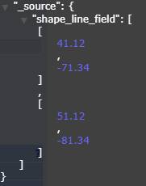

### 1.4.3、polygon

一个多边形是由一个点列表的列表定义的。每个(外部)列表的第一个和最后一个点必须是相同的(多边形必须是封闭的)。下面是一个GeoJSON多边形的例子。
> **putMapping**
>> **Java Client**  
> > 如果为true(默认)，将接受三个维度点(存储在源中)，但只有纬度和经度值将被索引  
> > `Property.of(p -> p.shape(g -> g.ignoreZValue(false).ignoreMalformed(true)))`
>
>> **Rest Api**
>> ```java
>> PUT /shape_polygon_create_index/_mapping
>> {"properties":{"shape_polygon_field":{"type":"shape","ignore_malformed":true,"ignore_z_value":false}}}
>> ```
>> **结果**  
> > 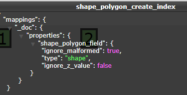

> **index**
>> **Java Client**
>> ```java
>>      Map<String,Object> map=new HashMap<>(2);
>>      map.put("type","polygon");
>>      map.put("coordinates",lists);//lists=[[11.12,-71.34],[21.12,-81.34],[31.12,-81.34]]
>>      data.put("shape_polygon_field",map)
>> ```
>
>> **Rest Api**
>> ```java
>> POST /shape_polygon_create_index/_doc
>> {"shape_polygon_field":{
>>      "type":"polygon",
>>      "coordinates":[[11.12,-71.34],[21.12,-81.34],[31.12,-81.34]]
>> }}
>> ```
>> **结果**  
> 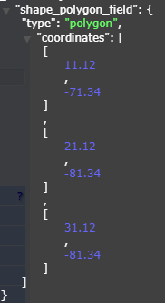

### 1.4.4、circle

一个多边形是由一个点列表的列表定义的。每个(外部)列表的第一个和最后一个点必须是相同的(多边形必须是封闭的)。下面是一个GeoJSON多边形的例子。
> **putMapping**
>> **Java Client**  
> > 如果为true(默认)，将接受三个维度点(存储在源中)，但只有纬度和经度值将被索引  
> > `Property.of(p -> p.shape(g -> g.ignoreZValue(false).ignoreMalformed(true)))`
>
>> **Rest Api**
>> ```java
>> PUT /shape_circle_create_index/_mapping
>> {"properties":{"shape_circle_field":{"type":"shape","ignore_malformed":true,"ignore_z_value":false}}}
>> ```
>> **结果**  
> > 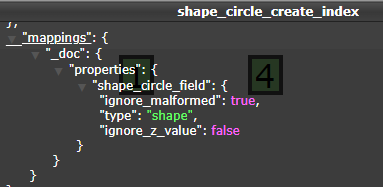

> **index**
>> **Java Client**
>> ```java
>>      Map<String, Object> map = new HashMap<>(2);
>>      map.put("type", "circle");
>>      // 圆心坐标，格式: [经度, 纬度]
>>      map.put("coordinates", Arrays.asList(circle.getCenter().getLon(), circle.getCenter().getLat()));
>>      //圆的半径
>>      map.put("radius", circle.getRadius());
>>      data.put("shape_polygon_field",map)
>> ```
>
>> **Rest Api**
>> ```java
>> POST /shape_circle_create_index/_doc
>> {"shape_circle_field":{
>>      "type":"circle",
>>      "coordinates":[31.12,-81.34],
>>      "radius":100.0}}
>> ```
>> **结果**  
> > 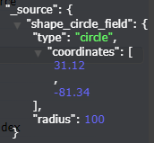

### 1.4.5、envelope (矩形)

一个多边形是由一个点列表的列表定义的。每个(外部)列表的第一个和最后一个点必须是相同的(多边形必须是封闭的)。下面是一个GeoJSON多边形的例子。
> **putMapping**
>> **Java Client**  
> > 如果为true(默认)，将接受三个维度点(存储在源中)，但只有纬度和经度值将被索引  
> > `Property.of(p -> p.shape(g -> g.ignoreZValue(false).ignoreMalformed(true)))`
>
>> **Rest Api**
>> ```java
>> PUT /shape_rect_create_index/_mapping
>> {"properties":{"shape_rect_field":{"type":"shape","ignore_malformed":true,"ignore_z_value":false}}}
>> ```
>> **结果**  
> > 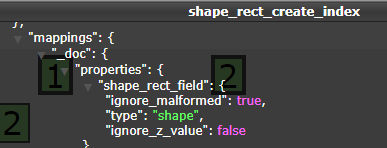

> **index**
>> **Java Client**
>> ```java
>>      Map<String, Object> map = new HashMap<>(2);
>>      map.put("type", "envelope");
>>      //矩形左上角坐标,矩形右下角坐标
>>      map.put("coordinates", Arrays.asList(leftTop, rightBottom));
>>      data.put("shape_polygon_field",map)
>> ```
>
>> **Rest Api**
>> ```java
>> POST /shape_rect_create_index/_doc
>> {"shape_rect_field":{
>>      "type":"envelope",
>>      "coordinates":[[31.12,-81.34],[41.12,-71.34]]}}
>> ```
>> **结果**  
> > 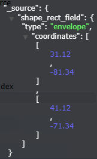
